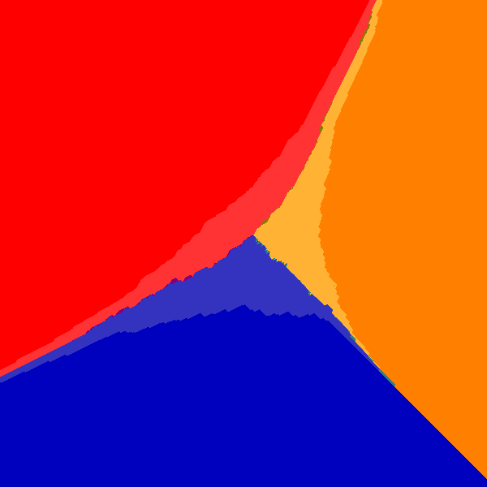

# SwingPlotter

Plots the effects of popular vote swings for Canadian federal elections.

# Swing Model

The swing model used for seat projections is uniform swing based on
Canadian federal election 2015. See `data/` directory for dataset.

# Example Image



The x-axis is Liberal/NDP swing, and the y-axis is Liberal/Conservative swing.
The centre of the image is when (LIB, CON, NDP) = (30%, 30%, 30%).

Lighter colours represent minority parliaments, and mixed colours represent
2-way or 3-way ties.

# Setup and Run

```
npm install
gulp
```

# Technologies

- [**GPU.js**](http://gpu.rocks)
- [**Gulp**](http://gulpjs.com)
- [**Sass**](http://sass-lang.com)
- [**Babel**](https://babeljs.io)
- [**JSHint**](http://jshint.com)

